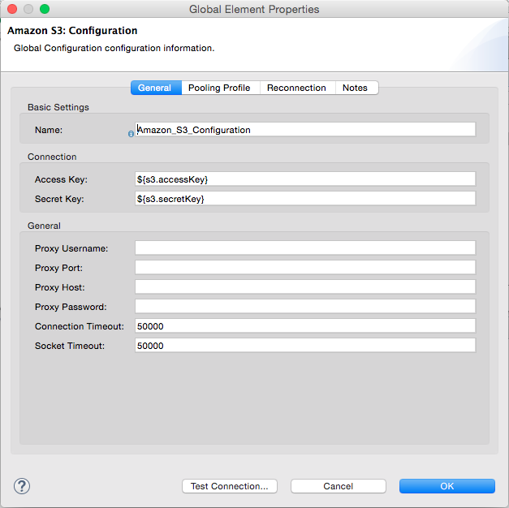
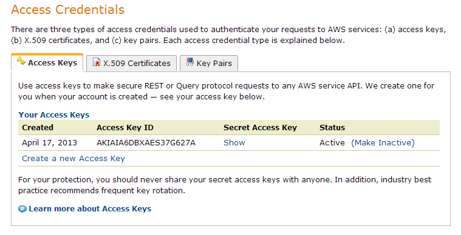
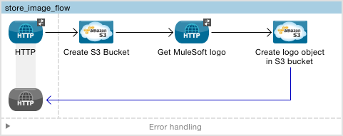

[Purpose](#purpose)  
[Prerequisites](#prerequisites)  
[Initial setup of the Mule project](#initial-setup-of-the-mule-project)  
[Building the flows](#building-the-flows)
[Resources](#other-resources)

Purpose
=======

In this sample, I'll show how to build a simple application with Mule that stores an image from a URL on Amazon S3, then retrieves and displays the image.

Prerequisites
=============

In order to build and run this project you'll need

● To have an Amazon AWS account and signed up for Amazon S3. [http://aws.amazon.com/s3/](http://aws.amazon.com/s3/)

● To have downloaded and installed. [Anypoint Studio Community edition](http://www.mulesoft.org/download-mule-esb-community-edition) on your computer

Initial setup of the Mule project
=================================

If you haven't installed Anypoint Studio on your computer yet, it's time to download Anypoint Studio from this location: [http://www.mulesoft.org/download-mule-esb-community-edition](http://www.mulesoft.org/download-mule-esb-community-edition). You also have the option of downloading a 30 day trial of Mule Enterprise Edition from this location [http://www.mulesoft.com/mule-esb-enterprise](http://www.mulesoft.com/mule-esb-enterprise) if you want to evaluate and purchase the premium edition. This demo can be built using either community or enterprise edition. There is no specific installation that you need to run. Once you unzip the zip file to your desired location, you are ready to go. To install the Amazon S3 connector, you can download and install it from Anypoint Connectors Update Site. To do that:

1. Open Anypoint Studio and from "Help" menu select "Install New Software...". Installation dialog box opens.

2. From "Work with" drop down, select "Anypoint Connectors Update Site". The list of available connectors will be shown to you.

3. Find and select the Amazon S3 connector in the list of available connectors, the tree structure that is shown. A faster way to find a specific connector is to filter the list by typing the name of the connector in the input box above the list. You can choose more than one connector to be installed at once.

4. When you are done selecting the connectors to be installed, click on "Next" button. Details of each connector are shown on the next page. Click on "Next" button again and accept the terms of the license agreement.

5. Click on "Finish" button. The connector is downloaded and installed onto Studio. You'll need to restart the Studio for the installation to be completed.

Building the flows
==================

Now that you've got your Anypoint Studio up and running, it's time to work on the Mule App. Create a new Mule Project by clicking on "File \> New \> Mule Project". In the new project dialog box, the only thing you are required to enter is the name of the project. You can click on "Next" to go through the rest of pages.

The first thing to do in your new app is to configure the connection to Amazon S3. In the message flow editor, click on "Global Elements" tab on the bottom of the page. Then click on "Create" button on the top right of the tab. In the "Choose Global Element" type dialog box that opens select "Amazon S3: Configuration" under "Connector Configuration" and click ok.

In the Amazon S3 configuration dialog box that follows, you need to enter the following information. On the "General" tab, enter a name for your configuration settings such as "Amazon_S3_Configuration". Also, put the "Access Key" and "Secret Key" from your Amazon AWS account in their respective fields or in mule-app.properties. These values can be found [here](https://portal.aws.amazon.com/gp/aws/securityCredentials). If you have not accessed your Amazon AWS account remotely before, you will need to click **Create a new Access Key** in the Access Credentials box. You are done with the configuration. Click "Ok" to close the dialog box.

The XML for the global element should look like this:

      <s3:config name="Amazon_S3_Configuration" accessKey="${s3.accessKey}" secretKey="${s3.secretKey}" doc:name="Amazon S3: Configuration"/>

It's time to build the flow that stores the image on Amazon S3 now that we have our connection to Amazon S3 set up in Mule app. You will then create a second flow which retrieves the image and displays it in a browser. Here is how to create those flows:

Store Image Flow
----------------

This is the flow which creates a bucket on S3 to store the image, retrieve an image from a specified URL, and stores the image in newly created bucket.
Start by dropping an HTTP endpoint on the flow from the palette. The only parameters you need to configure for this endpoint is "Host", "Port", and "Path". Change host to "localhost", port to "8081", and Path to "create". This is the URL you'd call to start the flow. Then drop an Amazon S3 connector from the palette onto the endpoint. In the configuration box for the Amazon S3 connector, select the previously created Amazon S3 configuration from the Config Reference dropdown menu. Change the operation to "Create Bucket", and set the Bucket Name to "mule-s3-demo", the Acl to "PUBLIC_READ", and the region to "US_STANDARD".

Now drop another HTTP endpoint on the Amazon S3. This endpoint will retrieve an image from the Mulesoft website. Configure the Host to "www.mulesoft.org", the Port to "80", the Path to "sites/all/themes/mulesoft_community/logo.png", and set the Method to "GET". Then drop another Amazon S3 connector onto this new HTTP Endpoint. In the configuration box for the Amazon S3 connector, select the previously created Amazon S3 configuration from the Config Reference dropdown menu. Change the operation to "Create Object", and set the Bucket Name to "mule-s3-demo", the Key to "mulesoft.png", the Acl to "PUBLIC_READ", and the Storage Class to "STANDARD". This completes the Store Image Flow.

Retrieve Image Flow
-------------------

This is the flow which retrieves and displays the image stored by the first flow. Drag a new Flow Scope from the palette to below the store_image_flow. Drag an HTTP endpoint onto the flow, and configure the Host to "localhost", the Port to "8081", and the Path to "get." Then drag an Amazon S3 connector onto this endpoint. In the configuration box for the Amazon S3 connector, select the previously created Amazon S3 configuration from the Config Reference dropdown menu. Change the operation to "Get object content" and set the Bucket Name to "mule-s3-demo" and the Key to "mulesoft.png". This completes the Retrieve Image Flow.

Flow XML
--------

The final flow XML should look like this. Pay attention "accessKey" and "secretKey" will be different for your app than the values here.

    <?xml version="1.0" encoding="UTF-8"?>

    <mule xmlns:tracking="http://www.mulesoft.org/schema/mule/ee/tracking" xmlns:http="http://www.mulesoft.org/schema/mule/http" xmlns:s3="http://www.mulesoft.org/schema/mule/s3" xmlns="http://www.mulesoft.org/schema/mule/core" xmlns:doc="http://www.mulesoft.org/schema/mule/documentation"
    	xmlns:spring="http://www.springframework.org/schema/beans" version="EE-3.6.0"
    	xmlns:xsi="http://www.w3.org/2001/XMLSchema-instance"
    	xsi:schemaLocation="http://www.springframework.org/schema/beans http://www.springframework.org/schema/beans/spring-beans-current.xsd
    http://www.mulesoft.org/schema/mule/core http://www.mulesoft.org/schema/mule/core/current/mule.xsd
    http://www.mulesoft.org/schema/mule/http http://www.mulesoft.org/schema/mule/http/current/mule-http.xsd
    http://www.mulesoft.org/schema/mule/s3 http://www.mulesoft.org/schema/mule/s3/current/mule-s3.xsd
    http://www.mulesoft.org/schema/mule/ee/tracking http://www.mulesoft.org/schema/mule/ee/tracking/current/mule-tracking-ee.xsd">
        <http:listener-config name="HTTP_Listener_Configuration" host="0.0.0.0" port="8081" doc:name="HTTP Listener Configuration"/>
        <http:request-config name="HTTP_Request_Configuration" host="mulesoft.org" port="80"  doc:name="HTTP Request Configuration"/>
        <s3:config name="Amazon_S3_Configuration" accessKey="${s3.accessKey}" secretKey="${s3.secretKey}" doc:name="Amazon S3: Configuration"/>
        <flow name="store_image_flow">
            <http:listener config-ref="HTTP_Listener_Configuration" path="/create" doc:name="HTTP"/>
            <s3:create-bucket config-ref="Amazon_S3_Configuration" bucketName="${s3.bucketName}" doc:name="Create S3 Bucket" acl="PUBLIC_READ"/>
            <http:request config-ref="HTTP_Request_Configuration" path="sites/all/themes/mulesoft_community/logo.png" method="GET" doc:name="Get MuleSoft logo"/>
            <s3:create-object config-ref="Amazon_S3_Configuration" doc:name="Create logo object in S3 bucket" bucketName="${s3.bucketName}" key="mulesoft.png" acl="PUBLIC_READ"/>
        </flow>
        <flow name="get_image_flow">
            <http:listener config-ref="HTTP_Listener_Configuration" path="/get" doc:name="HTTP"/>
            <s3:get-object-content config-ref="Amazon_S3_Configuration" bucketName="${s3.bucketName}" key="mulesoft.png" doc:name="Get Image"/>
        </flow>
    </mule>

Testing the project
-------------------

Now it's time to test the app. Run the app in Anypoint Studio and open a browser window. Visit [http://localhost:8081/create](http://localhost:8081/create). This will load the image into Amazon S3, but it will not return anything to the browser. If you visit [https://console.aws.amazon.com/s3](https://console.aws.amazon.com/s3) you will see the mule-s3-demo bucket and, inside the bucket, the stored image.
Now visit [http://localhost:8081/get](http://localhost:8081/get), which will retrieve the image and return it to the browser window.

Other resources
===============

For more information on:

●     Amazon S3 connector, please visit [Amazon Simple Storage Service (S3) Connector](http://www.mulesoft.org/connectors?title=s3)
●     Mule platform and how to build Mule apps, please visit  [http://www.mulesoft.org/documentation](http://www.mulesoft.org/documentation/display/current/Home)
